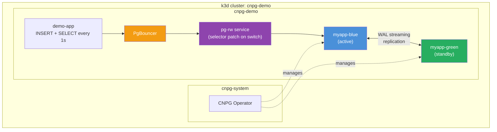
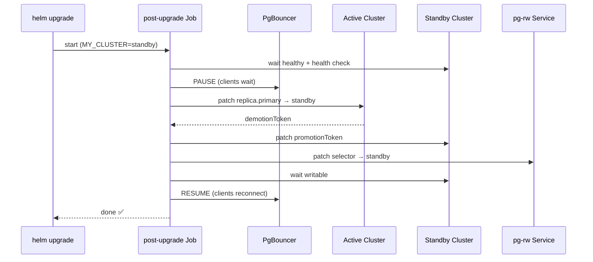

# Blue/Green PostgreSQL Deployments with CloudNativePG

Zero-downtime database deployments using [CloudNativePG](https://cloudnative-pg.io/)
distributed topology on Kubernetes.

Built for the conference talk:
**"Blue/Green für Datenbanken: Zero Downtime Deployments mit Kubernetes und CNPG"**

## Architecture



## How It Works

You specify **one database**. The Helm chart internally manages:

- Two CNPG clusters (`<name>-blue`, `<name>-green`) with streaming replication
- Services (`pg-rw`, `pg-ro`, `pg-r`) routing traffic via selector patches
- PgBouncer for connection pooling + PAUSE/RESUME during switchover
- Helm hooks (post-upgrade Jobs) that orchestrate zero-downtime switchover

On `helm install`: both clusters are deployed, replication is set up automatically.  
On `helm switchover`: hooks pause PgBouncer → wait for standby healthy → demote/promote → patch services → resume.



## Prerequisites

- [Docker](https://docs.docker.com/get-docker/)
- [k3d](https://k3d.io/)
- [kubectl](https://kubernetes.io/docs/tasks/tools/)
- [Helm](https://helm.sh/docs/intro/install/)

## Quick Start

```bash
make setup      # Create k3d cluster + install CNPG operator
make images     # Build & load hooks + app images (optional — see below)
make install    # Deploy blue/green database (one command!)
make app        # Deploy demo app
make logs       # Watch zero-downtime proof
make switchover # Trigger switchover via config change
```

## Demo Flow (Step-by-Step)

### 1. Setup infrastructure

```bash
make setup
```

Creates a k3d cluster and installs the CNPG operator.

### 2. Build & load images (optional)

```bash
make images
```

Builds the hooks container and demo app locally, tags them as
`ghcr.io/m4s-b3n/cnpg-blue-green/cnpg-bg-hooks:latest` / `ghcr.io/m4s-b3n/demo-app:latest`,
and imports them into k3d. Skipping this step is fine — k3d will pull the
published images from ghcr.io on first use.

### 3. Install the database

```bash
make install
```

Deploys the blue/green chart. This creates:

- `myapp-blue` cluster (primary, initdb)
- `myapp-green` cluster (replica, pg_basebackup from blue)
- Services, PgBouncer, replication secrets
- A post-install hook Job that waits for everything to be healthy

### 4. Deploy the demo app

```bash
make app
```

Deploys a Go app that writes + reads every second, logging latency.

### 5. Watch the logs

```bash
make logs
# [2026-05-25T11:00:01Z] WRITE ok | rows=42 | latency=5ms
# [2026-05-25T11:00:02Z] WRITE ok | rows=43 | latency=4ms
```

### 6. Trigger a switchover

```bash
# Change something, e.g. a PostgreSQL parameter:
make switchover
```

Watch the logs — no interruption! The hooks handle:

1. Record active/standby state
2. Wait for standby to reconcile
3. Pause PgBouncer → demote → promote → patch services → resume

### 7. Clean up

```bash
make clean          # Remove app + database (operator + cluster stay)
make delete-cluster # Remove the k3d cluster entirely
```

## Building Images Locally

Images are built with the same name as the published ghcr.io images so the
chart's default values work without any `--set` overrides:

```bash
# Build individual images
make hooks-build    # Build hooks container
make app-build      # Build demo app container

# Build + import into k3d (all-in-one)
make images         # Builds both, loads into k3d cluster

# Or individually:
make hooks-load     # Build + import hooks
make app-load       # Build + import app
```

Images are tagged `ghcr.io/m4s-b3n/cnpg-blue-green/cnpg-bg-hooks:latest` and
`ghcr.io/m4s-b3n/demo-app:latest` — matching `charts/cnpg-bg/values.yaml`
defaults exactly. `imagePullPolicy: IfNotPresent` means k3d uses the imported
image when present, or pulls from ghcr.io when `make images` was skipped.

### Customizing image names

```bash
make images HOOKS_IMAGE_REPO=myrepo/cnpg-bg-hooks
make images APP_REPO=myrepo/demo-app
```

## Project Structure

```
images/                      One subdir per Docker image (source + Dockerfile co-located)
  cnpg-bg-hooks/
    Dockerfile               Hooks image (alpine + kubectl + helm)
    .dockerignore
    scripts/
      entrypoint.sh          Dispatches on HOOK_ACTION env var
      common.sh              Shared functions
      post-install.sh        Creates repl user, waits for clusters
      post-upgrade.sh        Orchestrates zero-downtime switchover
      health-check.sh        Cluster health gate
      switchover.sh          Standalone manual switchover
    .releaserc.json          semantic-release config (monorepo)
    package.json
  demo-app/
    Dockerfile               Demo app image (Go)
    .dockerignore
    main.go                  Go app (writes/reads every 1s)
    go.mod / go.sum
    .releaserc.json          semantic-release config (monorepo)
    package.json

charts/cnpg-bg/              The unified Helm chart
  Chart.yaml
  values.yaml                Single database definition
  templates/
    _helpers.tpl             Template helpers
    cluster.yaml             Blue + green CNPG clusters (mode-driven)
    services.yaml            pg-rw, pg-ro, pg-r
    pgbouncer.yaml           Connection pooler
    secrets.yaml             App + replication credentials
    rbac.yaml                ServiceAccount + Role for hooks
    hook-post-install.yaml   Post-install Job
    hook-post-upgrade.yaml   Post-upgrade Job
    status-configmap.yaml    Switchover phase tracking
  .releaserc.json            semantic-release config (monorepo)
  package.json

deploy/                      Deployment configs (no source code)
  demo-app/
    values.yaml              Chartpack values for demo app deployment
  cnpg-bg/
    blue-values.yaml         Example override values for blue cluster
    green-values.yaml        Example override values for green cluster

scripts/                     Make target implementations (called by Makefile)
  setup.sh                   Create k3d cluster + install CNPG operator
  hooks-build.sh / hooks-load.sh
  app-build.sh / app-load.sh
  install.sh                 helm upgrade --install infra/blue/green
  switchover.sh              Detect active side, upgrade standby first
  app-deploy.sh              Deploy demo app via Helm
  logs.sh / status.sh / clean.sh / delete-cluster.sh / monitor.sh

.github/workflows/
  release.yml                CI: lint → build images → semantic-release per component
  onrelease.yml              On component tag: retag image or push Helm chart to OCI
```

## Troubleshooting

**Hook job failing?**

```bash
kubectl logs job/myapp-bg-post-install -n cnpg-demo
kubectl logs job/myapp-bg-post-upgrade -n cnpg-demo
```

**Clusters not ready?**

```bash
kubectl get clusters -n cnpg-demo -o wide
kubectl describe cluster myapp-blue -n cnpg-demo
```

**Replication not working?**

```bash
kubectl exec -n cnpg-demo $(kubectl get cluster myapp-blue -n cnpg-demo \
  -o jsonpath='{.status.currentPrimary}') -c postgres -- \
  psql -U postgres -c "SELECT * FROM pg_stat_replication;"
```

**App can't connect?**

```bash
kubectl get endpoints pg-rw pgbouncer -n cnpg-demo
```

## Known Limitations

### CNPG `Pooler` CRD is not used

CloudNativePG ships a first-party `Pooler` CRD that manages a PgBouncer
deployment. It was evaluated but is not suitable for this architecture for two
reasons:

1. `spec.cluster.name` must reference a specific `Cluster` resource — it cannot
   point to an arbitrary service such as the `pg-rw` Service used here as the
   blue/green switching layer.
2. The `[databases]` section of `pgbouncer.ini` is generated internally by CNPG
   and cannot be fully overridden, making it impossible to route traffic through
   a custom service.

As a result, PgBouncer is deployed as a standalone `Deployment` whose
`pgbouncer.ini` is provided via a `ConfigMap`, and the `pg-rw` Service selector
is patched during switchover to redirect traffic between the blue and green
clusters.

### Pod restart on promotion (CNPG ≤ 1.29)

When a replica cluster is promoted to primary, CNPG changes `archive_mode` from
`"always"` to `"on"`. Since this is a PostgreSQL fixed parameter, it requires a
**full pod restart** of all instances in the promoted cluster. This means the
switchover is not truly instantaneous — after the promotion patch, the pods
restart and the cluster is briefly unavailable until they come back up.

In practice, PgBouncer's PAUSE absorbs most of this (clients wait rather than
error), but the switchover takes longer than the theoretical minimum.

**Fix:** [cloudnative-pg#10666](https://github.com/cloudnative-pg/cloudnative-pg/pull/10666)
changes CNPG to always set `archive_mode=always` and moves the archiving
decision into the archiver logic. Once merged, promotion no longer requires a
restart and the switchover becomes near-instantaneous.

## References

- [CloudNativePG Documentation](https://cloudnative-pg.io/docs/)
- [CNPG Distributed Topology](https://cloudnative-pg.io/docs/1.25/replica_cluster/#distributed-topology)
- [k3d Documentation](https://k3d.io/)
